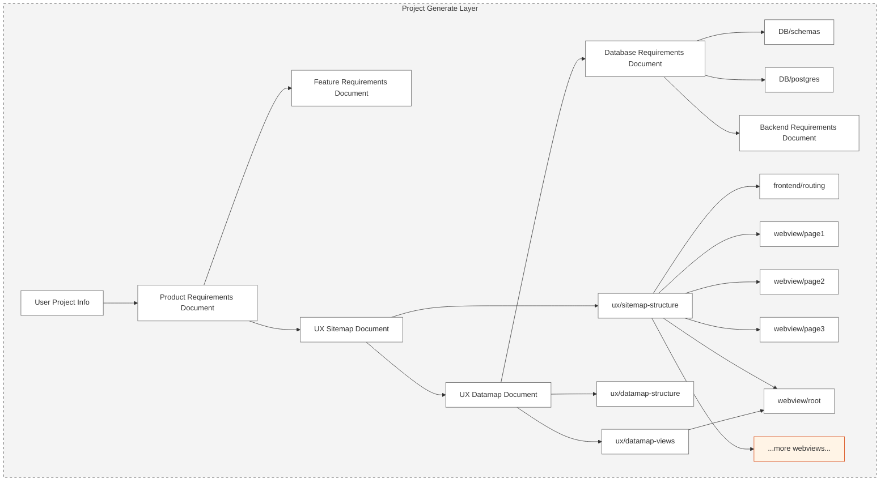

> [!CAUTION]  
> Still working on it, it will release soon


Welcome to CODEFOX! A next generation AI sequence full stack project generator with interactive chatbot

# News

🌟 Oct. 18, 2024: First line of Codefox code committed.

# Exciting features

💻 **Transforming Ideas into Projects**  
🚀 **Extraordinary Modeling System**: Integrates an AI model to seamlessly connect every aspect of your project.  
🤖 **Multi-Agent Generator**: Create and manage multiple intelligent agents to enhance project functionality.
⚡ **One-Click Deployment**: Deploy your project effortlessly to cloud services or clone it locally with ease.  
✨ **Live Preview**: Interact with your project while engaging in AI-powered conversations to make real-time modifications.  
🔧 **Precise Code Customization**: Leverage targeted and efficient visual tools for precise module adjustments.

## Support

> [!WARNING]  
> adding later

**Revolutionize development with this disruptive platform. Join now and set the new standard!**



# CodeFox Development Guide

## Prerequisites

Before you begin, ensure you have the following installed:

- Node.js >= 18.0.0
- PNPM 9.1.2 (`npm install -g pnpm@9.1.2`)
- Tmux >= 3.2
- Tmuxinator >= 3.0.0 (`gem install tmuxinator`)

## Project Structure

The project consists of three main components:

```
codefox/
├── backend/         # NestJS backend server
├── frontend/        # Next.js frontend application
└── llm-server/     # LLM service
```

## Installation

1. Clone the repository:

```bash
git clone <repository-url>
cd codefox
```

2. Install dependencies:

```bash
pnpm install
```

3. Set up environment variables:

```bash
# Copy and configure environment files for each service
cp backend/.env.template backend/.env
cp frontend/.env.template frontend/.env
cp llm-server/.env.template llm-server/.env
```

## Development

### Using Tmuxinator (Recommended)

The project includes a Tmuxinator configuration for easy development. This will start all services in separate windows with proper layouts:

```bash
pnpm dev:tmux
```

This command will create:

- Window 1: Backend server
- Window 2: Frontend development server (left) and GraphQL codegen watcher (right)
- Window 3: LLM server

Tmux Navigation:

- `Ctrl+a 1/2/3` - Switch between windows
- `Ctrl+a r` - Restart current pane's service
- `Ctrl+a d` - Detach from session

### Manual Development

If you prefer to run services individually:

```bash
# Start all services
pnpm dev

# Or start services individually
pnpm dev:backend    # Start backend only
cd frontend && pnpm dev  # Start frontend only
cd llm-server && pnpm dev  # Start LLM server only
```

## Additional Commands

```bash
pnpm build          # Build all packages
pnpm lint          # Run linting
pnpm format        # Format code
pnpm test          # Run tests
```

## GraphQL Code Generation

The frontend uses GraphQL with automatic type generation. The codegen watcher is automatically started in the Tmuxinator setup, but you can also run it manually:

```bash
cd frontend
pnpm generate:watch
```

## Troubleshooting

If you encounter any issues:

1. Ensure all environment variables are properly set
2. Check if all required services are running
3. Clear node_modules and reinstall dependencies:

```bash
pnpm clean
pnpm install
```

4. For Tmuxinator issues:
   - Ensure Tmux is running version 3.2 or higher
   - Check if the session is already running: `tmux ls`
   - Kill existing session if needed: `tmux kill-session -t codefox`

## License

ISC
