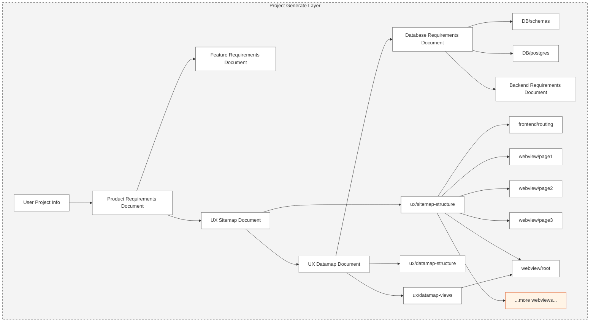

> [!CAUTION]  
> Still working on it, it will release soon

Welcome to CODEFOX! A next generation AI sequence full stack project generator with interactive chatbot

# News

🌟 Oct. 18, 2024: First line of Codefox code committed.

# Exciting features

💻 **Transforming Ideas into Projects**  
🚀 **Extraordinary Modeling System**: Integrates an AI model to seamlessly connect every aspect of your project.  
🤖 **Multi-Agent Generator**: Create and manage multiple intelligent agents to enhance project functionality.
⚡ **One-Click Deployment**: Deploy your project effortlessly to cloud services or clone it locally with ease.  
✨ **Live Preview**: Interact with your project while engaging in AI-powered conversations to make real-time modifications.  
🔧 **Precise Code Customization**: Leverage targeted and efficient visual tools for precise module adjustments.

## Support

> [!WARNING]  
> adding later

**Revolutionize development with this disruptive platform. Join now and set the new standard!**

