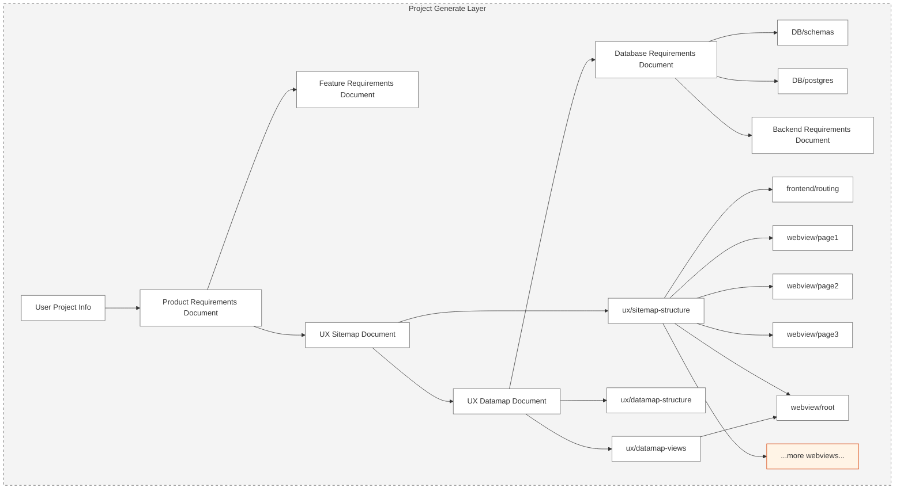

# CODEFOX

Still on progress

```mermaid
graph TD
    subgraph Project_Generate_Layer[Project Generate Layer]
        UP[User Project Info] --> PRD[Product Requirements Document]
        PRD --> FRD[Feature Requirements Document]
        PRD --> UXSD[UX Sitemap Document]
        UXSD --> UXDD[UX Datamap Document]
        UXDD --> DRD[Database Requirements Document]
        DRD --> DBS[DB/schemas]
        DRD --> DBP[DB/postgres]
        DRD --> BRD[Backend Requirements Document]

        %% Frontend related generations
        UXSD --> USS[ux/sitemap-structure]
        USS --> ROUTE[frontend/routing]
        UXDD --> UDS[ux/datamap-structure]
        UXDD --> UDV[ux/datamap-views]

        %% Webview generations
        USS --> WV1[webview/page1]
        USS --> WV2[webview/page2]
        USS --> WV3[webview/page3]
        USS --> ROOT[webview/root]
        UDV --> ROOT

        %% Optional: Show multiple pages with a note
        note[...more webviews...]
        USS --> note
    end

    %% Styling
    classDef default fill:#f9f9f9,stroke:#333,stroke-width:2px
    classDef boxStyle fill:#fff,stroke:#666,stroke-width:1px
    classDef noteStyle fill:#fff4e6,stroke:#d9480f,stroke-width:1px
    class UP,PRD,FRD,UXSD,UXDD,DRD,DBS,DBP,BRD,USS,UDS,UDV,ROUTE,WV1,WV2,WV3,ROOT boxStyle
    class note noteStyle
    classDef layerStyle fill:#f4f4f4,stroke:#666,stroke-width:1px,stroke-dasharray: 5 5
    class Project_Generate_Layer layerStyle
```
