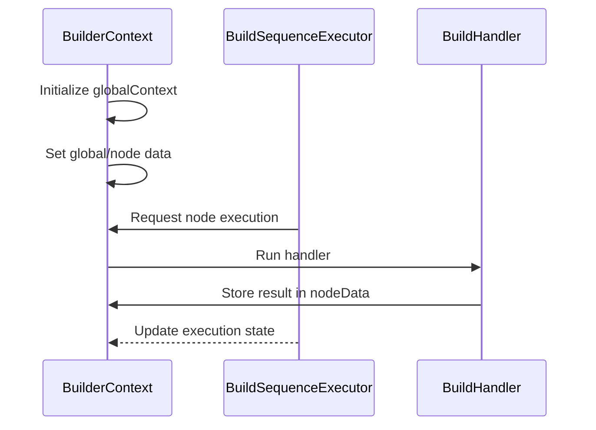

> [!CAUTION]  
> Still working on it, it will release soon

Welcome to CODEFOX! A next generation AI sequence full stack project generator with interactive chatbot.

  

# 🎉News

Oct. 18, 2024: First line of Codefox code committed.

# 🌟Exciting Features

### Build Your Project

- **One-Sentence Fullstack Project Generation:** Generate a fully functional, end-to-end fullstack project based on just one sentence input.
- **Dynamic Project Creation:** Even with identical inputs, every project is uniquely crafted using adaptive algorithms, ensuring a personalized solution every time.
- **Diverse Project Types & Architectures:** Build projects across multiple architectures, including _modular or monolithic front-end and back-end systems_.
  Upcoming features include _mobile app_ and _WeChat Mini Programs_.

### Refine Your Project

- **Interactive AI-Driven Project Refinement:** Fine-tune your project in real-time with AI-powered chat. Seamlessly optimize code and workflows as you go.
- **Token Capacity Assurance:** Generate fully deployable, production-grade projects ready for real-world applications—_no placeholders or toy projects_.
- **Multi-Agent Generator:** Design and manage multiple intelligent agents to enhance your project's functionality.
- **Live Preview:** Engage in AI-powered, real-time interactions to visualize and implement project changes.
- **Precise Code Customization:** Use powerful visual tools for targeted, efficient code adjustments that align with your specific requirements.

### Deploy Your Project

- **One-Click Deployment:** Deploy your project effortlessly to cloud platforms or clone it locally in a single step.
- **Extraordinary Modeling System:** Integrate AI models to harmoniously connect every aspect of your project for optimal performance.

# 🤖How It Works

This project supports **structured task orchestration** where tasks (nodes) are executed in a sequence or in parallel, depending on the configuration. The execution process is handled by several key components:

- **BuilderContext**: Manages the global state, execution context, and node data.
- **BuildSequenceExecutor**: Drives the overall execution flow, managing steps and nodes.
- **BuildHandler**: Executes individual tasks (nodes) and stores results.
- **HandlerManager**: Provides specific handlers for nodes.
- **ModelProvider**: Integrates external services like LLM API calls.

### **Sequence Diagram (Simplified Version)**

# 🚀Installation

> [!WARNING]  
> adding later

**STEP 1️⃣**

<!-- **Contribution（contributor/activity/star history）** -->
