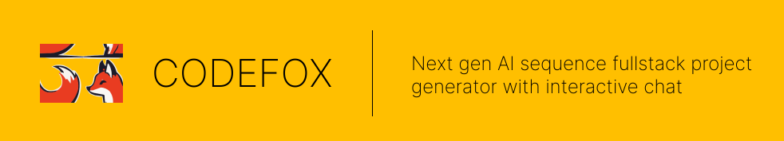
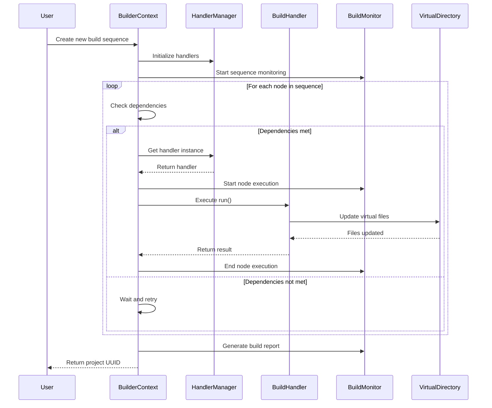
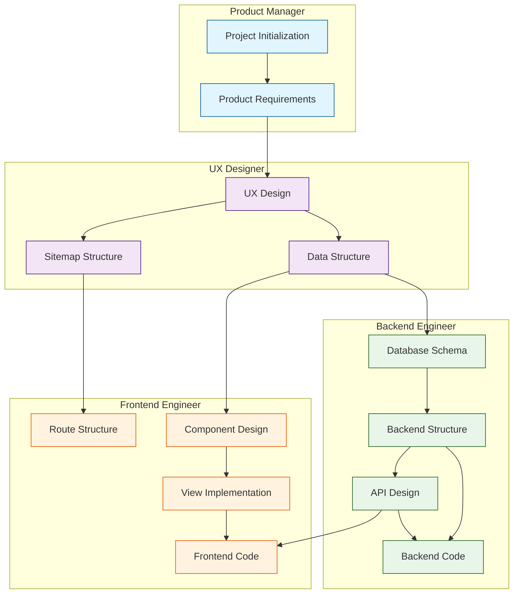

# CodeFox



Welcome to CODEFOX! A next generation AI sequence full stack project generator with interactive chatbot.

## Key Features

💻 **Transforming Ideas into Projects**
🚀 **Extraordinary Modeling System**: Integrates an AI model to seamlessly connect every aspect of your project.
🤖 **Multi-Agent Generator**: Create and manage multiple intelligent agents to enhance project functionality.
⚡ **One-Click Deployment**: Deploy your project effortlessly to cloud services or clone it locally with ease.
✨ **Live Preview**: Interact with your project while engaging in AI-powered conversations to make real-time modifications.
🔧 **Precise Code Customization**: Leverage targeted and efficient visual tools for precise module adjustments.

## Prerequisites

### System Requirements

- Node.js >= 18.0.0
- PostgreSQL >= 14.0
- GPU (Optional, for local LLM model running)
- Memory: Minimum 16GB RAM recommended
- Storage: At least 10GB free space

### Development Tools

- PNPM 9.1.2 (`npm install -g pnpm@9.1.2`)
- Tmux >= 3.2
- Tmuxinator >= 3.0.0 (`gem install tmuxinator`)

### Optional Requirements

- NVIDIA CUDA Toolkit (for GPU acceleration)
- Docker & Docker Compose (for containerized development)

## Installation

1. **Clone the repository**

```bash
git clone <repository-url>
cd codefox
```

2. **Install dependencies**

```bash
pnpm install
```

3. **Environment Configuration**

Create and configure environment files for each service:

**Backend (.env)**

```env
PORT=8080
JWT_SECRET=<your-jwt-secret>
JWT_REFRESH=<your-refresh-token-secret>
SALT_ROUNDS=10
OPENAI_BASE_URI=http://localhost:3001
```

**Frontend (.env)**

```env
NEXT_PUBLIC_GRAPHQL_URL=http://localhost:8080/graphql
```

**LLM Server (.env)**

```env
PORT=3001
MODEL_PATH=/path/to/model
MODEL_TYPE=llama
NODE_ENV=development
```

**Model Configuration (.codefox/config.json)**

Configure the AI models for chat and embedding. For cloud-based models, provide endpoint and token. For local models, omit the endpoint.

```json
{
  "$schema": "../config.schema.json",
  "chat": [
    {
      "model": "openai/gpt-4o-mini", // Required: Model identifier
      "alias": "gpt-4o-mini", // Required: Model alias for reference
      "endpoint": "https://openrouter.ai/api/v1", // Optional: API endpoint (omit for local models)
      "token": "<your-openrouter-token>", // Optional: API token (required if endpoint is specified)
      "default": true, // Optional: Set as default model
      "rps": 30 // Optional: Requests per second limit
    }
  ],
  "embedding": [
    {
      "model": "openai/text-embedding-ada-002", // Required: Model identifier
      "endpoint": "https://api.openai.com", // Optional: API endpoint (omit for local models)
      "token": "<your-openai-token>" // Optional: API token (required if endpoint is specified)
    }
  ]
}
```

Model Configuration Fields:

- **Chat Models**:

  - `model`: (Required) Model identifier
  - `alias`: (Required) Model reference name in the system
  - `endpoint`: (Optional) API endpoint URL. Omit for local models
  - `token`: (Optional) API access token. Required if endpoint is specified
  - `default`: (Optional) Set as the default model for chat
  - `rps`: (Optional) Rate limit for API requests per second

- **Embedding Models**:
  - `model`: (Required) Model identifier
  - `endpoint`: (Optional) API endpoint URL. Omit for local models
  - `token`: (Optional) API access token. Required if endpoint is specified

## Development

### Using Tmuxinator (Recommended)

Start all services with the pre-configured Tmuxinator setup:

```bash
pnpm dev
```

This creates a development environment with:

- Backend server (http://localhost:8080)
- Frontend development server (http://localhost:3000)
- LLM server (http://localhost:3001)
- GraphQL codegen watcher

### Manual Development

Start services individually:

```bash
# Start backend
cd backend
pnpm dev

# Start frontend
cd frontend
pnpm dev

# Start LLM server
cd llm-server
pnpm dev
```

### Development URLs

- Frontend: http://localhost:3000
- Backend GraphQL Playground: http://localhost:8080/graphql
- LLM Server: http://localhost:3001

## Architecture Overview

CodeFox consists of three main components that work together:

```
        +-------------+
        |  Frontend   |
        | (Next.js)   |
        +------+------+
               |
               | GraphQL
               |
        +------v------+
        |  Backend    |
        | (NestJS)    |
        +------+------+
               |
               | HTTP/WebSocket
               |
        +------v------+
        | LLM Server  |
        +-------------+
```

- **Frontend (Next.js)**: Provides the user interface and handles client-side logic
- **Backend (NestJS)**: Manages business logic, authentication, and project generation
- **LLM Server**: Handles AI model interactions and code generation

### Build System Architecture

The backend includes a sophisticated build system that manages project generation through a sequence of dependent tasks. Here's how it works:



Key components:

1. **BuilderContext**

   - Manages the execution state of build nodes
   - Handles dependency resolution
   - Coordinates between handlers and virtual filesystem

2. **BuildHandlerManager**

   - Singleton managing handler instances
   - Provides handler registration and retrieval
   - Manages handler dependencies

3. **BuildHandler**

   - Implements specific build tasks
   - Can declare dependencies on other handlers
   - Has access to virtual filesystem and model

4. **BuildMonitor**

   - Tracks execution progress
   - Records timing and success/failure
   - Generates build reports

5. **VirtualDirectory**
   - Manages in-memory file structure
   - Provides file operations during build
   - Ensures atomic file updates

### Full-Stack Project Generation Workflow

The build system follows a structured workflow to generate a complete full-stack project:



## Troubleshooting

### Common Issues

1. **Port Conflicts**

   - Ensure ports 3000, 8080, and 3001 are available
   - Check for any running processes: `lsof -i :<port>`

2. **Environment Issues**

   - Verify all environment variables are properly set
   - Ensure model path is correct in LLM server configuration
   - Verify model configurations in .codefox/config.json:
     - Check model identifiers are correct
     - Validate endpoint URLs for cloud-based models
     - Ensure API tokens are valid
     - Verify local model paths for non-cloud models

3. **Build Issues**

   ```bash
   # Clean installation
   pnpm clean
   rm -rf node_modules
   pnpm install

   # Rebuild all packages
   pnpm build
   ```

4. **Tmuxinator Issues**
   - Ensure Tmux version is >= 3.2: `tmux -V`
   - Kill existing session: `tmux kill-session -t codefox`
   - Check session status: `tmux ls`

## Additional Resources

- [API Documentation](./docs/api.md)
- [Contributing Guidelines](./CONTRIBUTING.md)
- [Change Log](./CHANGELOG.md)

## Support

For support and questions:

- GitHub Issues: [Create an issue](https://github.com/your-repo/issues)
- Documentation: [CodeFox Docs](./codefox-docs)

## License

ISC
