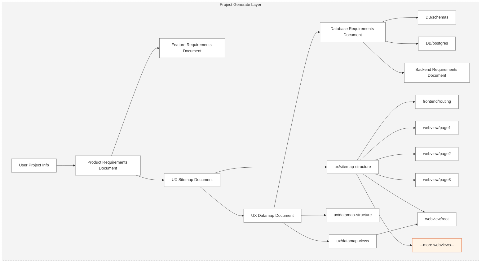

## CODEFOX
Welcome to CODEFOX! A next generation AI sequence full stack project generator with interactive chatbot
# Exciting features
- **🚀 Extraordinary Modeling system** : Integrated AI model, seamless connection of all aspects of the project.
- **💻 Automatic code generation** : Instant implementation of full stack code, fast development.
- **💬 Secure lifecycle Records** : Use SQLite to store data locally for maximum privacy and control.
- **🔄 Flexible integration** : Modular output to adapt to different needs, improving scalability and productivity.
- **📋 Document Automation** : Generate all required documents with one click for complete project lifecycle coverage.
- **🌟 Complete project ecosystem** : Seamlessly sync files, eliminate redundancy and ensure a cohesive system.
- **⚡ One-click deployment** : Easily deploy across environments, saving time and resources.
- **✨ Live Preview** : Makes real-time project updates with real-time rendering faster decisions.
- **🔧 Precise code customization** : provides targeted and efficient visual tools for module adjustment.

---

**Revolutionize development with this disruptive platform. Join now and set the new standard!**

Still on progress

