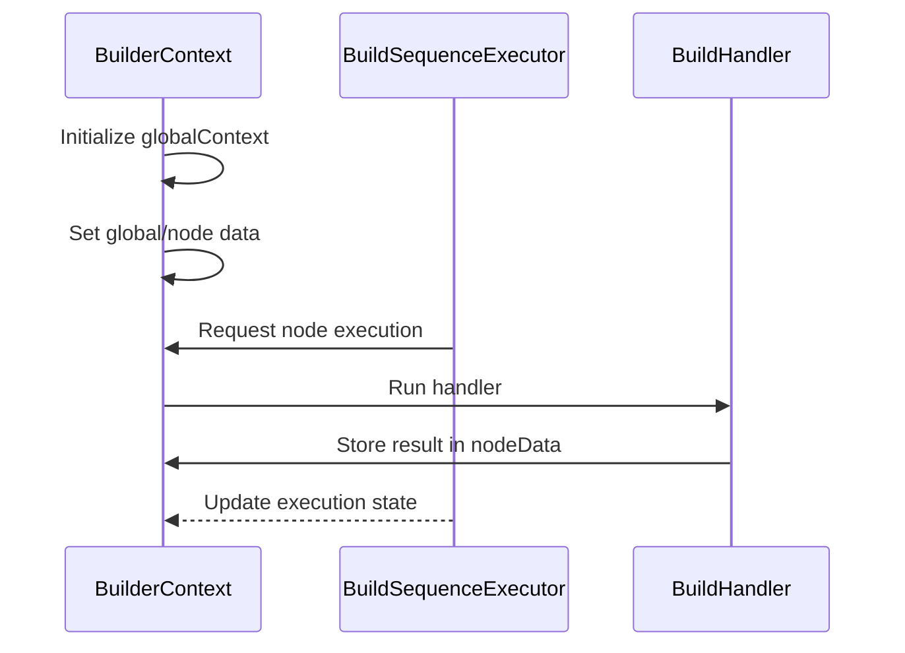
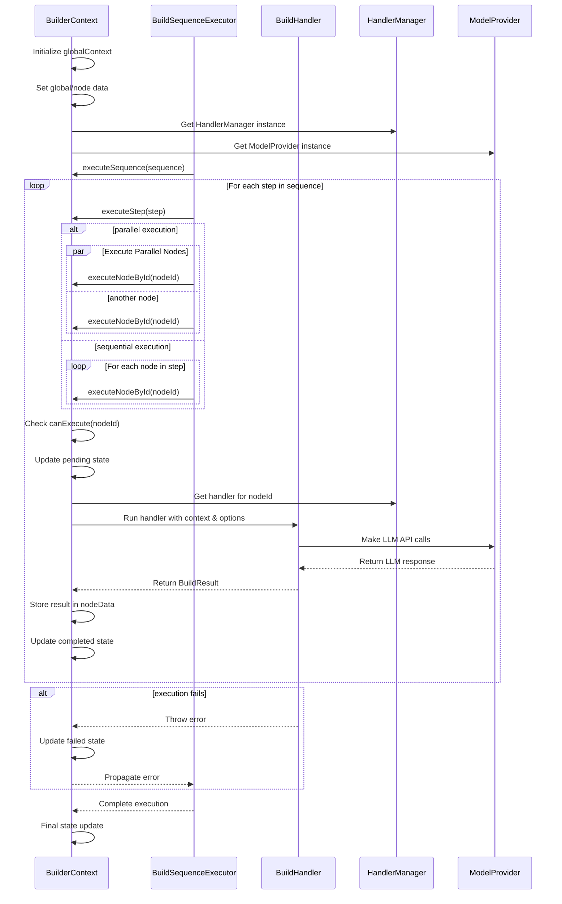

The easy version

```mermaid
sequenceDiagram
    participant Context as BuilderContext
    participant Executor as BuildSequenceExecutor
    participant Handler as BuildHandler

    Context->>Context: Initialize globalContext
    Context->>Context: Set global/node data
    Executor->>Context: Request node execution
    Context->>Handler: Run handler
    Handler->>Context: Store result in nodeData
    Executor-->>Context: Update execution state
```

The complete version for know

```mermaid
sequenceDiagram
participant Context as BuilderContext
participant Executor as BuildSequenceExecutor
participant Handler as BuildHandler
participant Manager as HandlerManager
participant Model as ModelProvider

    %% Initialization
    Context->>Context: Initialize globalContext
    Context->>Context: Set global/node data
    Context->>Manager: Get HandlerManager instance
    Context->>Model: Get ModelProvider instance

    %% Execution Flow
    Executor->>Context: executeSequence(sequence)
    loop For each step in sequence
        Executor->>Context: executeStep(step)
        alt parallel execution
            par Execute Parallel Nodes
                Executor->>Context: executeNodeById(nodeId)
            and another node
                Executor->>Context: executeNodeById(nodeId)
            end
        else sequential execution
            loop For each node in step
                Executor->>Context: executeNodeById(nodeId)
            end
        end
        Context->>Context: Check canExecute(nodeId)
        Context->>Context: Update pending state
        Context->>Manager: Get handler for nodeId
        Context->>Handler: Run handler with context & options
        Handler->>Model: Make LLM API calls
        Model-->>Handler: Return LLM response
        Handler-->>Context: Return BuildResult
        Context->>Context: Store result in nodeData
        Context->>Context: Update completed state
    end

    %% Error Handling
    alt execution fails
        Handler-->>Context: Throw error
        Context->>Context: Update failed state
        Context-->>Executor: Propagate error
    end

    %% Completion
    Executor-->>Context: Complete execution
    Context->>Context: Final state update
```